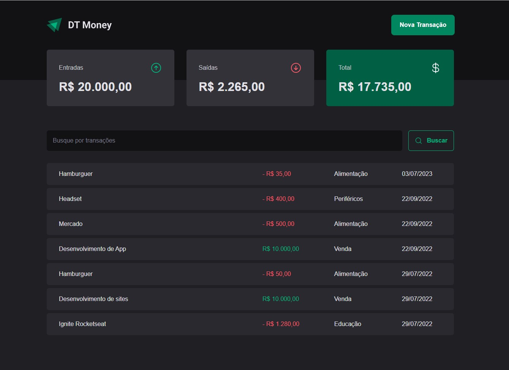

# Ignite React - 03 DT Money



## 📖 Sobre 

  Projeto para reforçar o fundamental na bibilioteca React, utilizando os principais conceitos (useContext, useState, useEffect, useCallback, useMemo e custom hooks) para desenvolver uma aplicação de controle financeiro básico.
  Utilizando: Typescript, styled-components, React Hook Form, Radix UI para componentes acessíveis, Axios, Zod e Phosphor React.

## 🚀 Tecnologias

  Essa aplicação tem seu front-end feito no framework React JS, e tem seu estado gerenciado por Redux.
  
  
## 📦 Como baixar o projeto

   Clonar os repositórios
   
   ```bash
    $ git clone https://github.com/freitasDavi/03-dt-money
   
    # Instalar o node/npm

    # Instalar as dependencias
  
    $ npm install
    
    # Inicializar a aplicação

    $ npm run dev:server

    $ npm run dev

